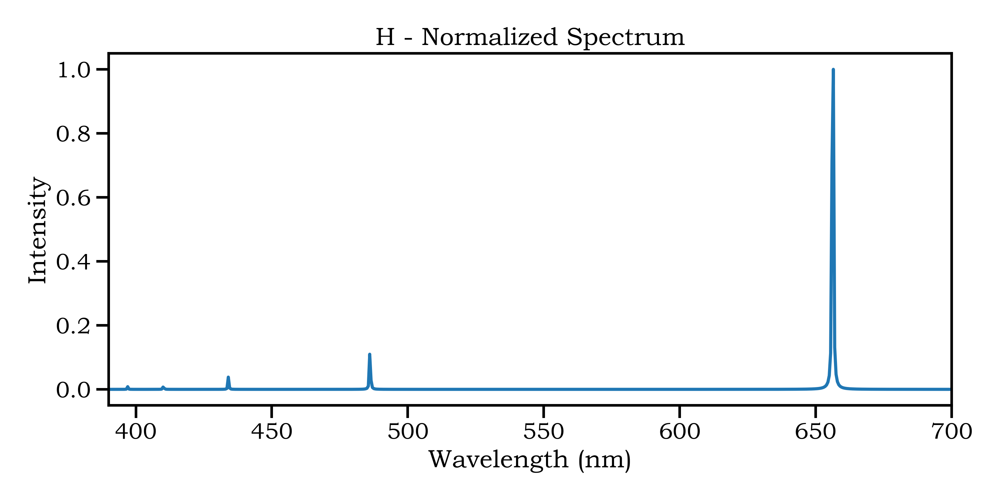
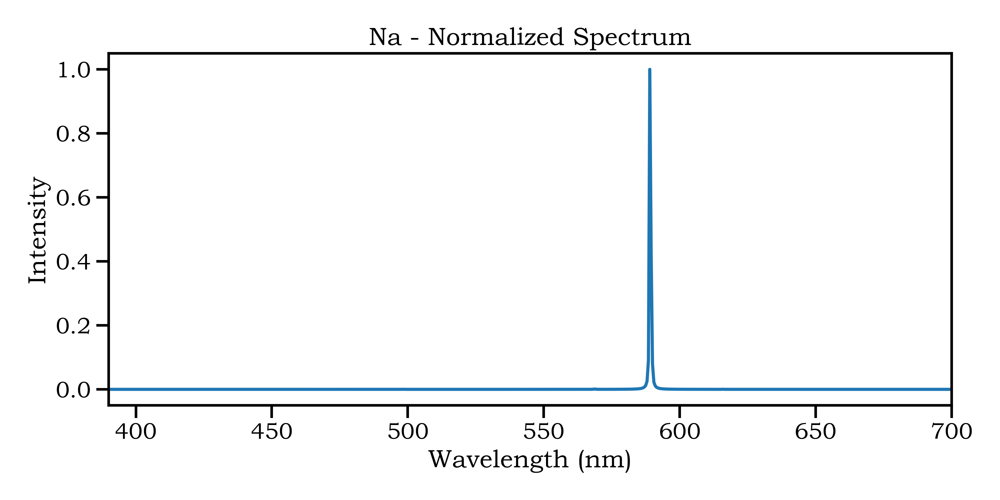
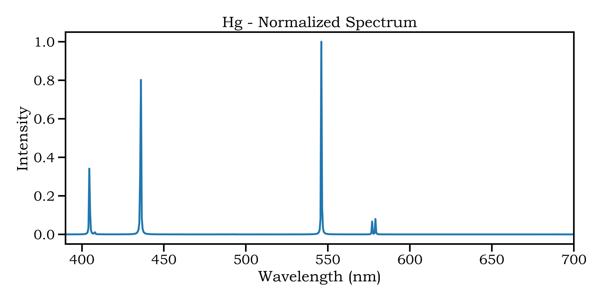

# synthetic

Synthetic spectra file samples with this characteristics:

| Element | Temperature K | Line Width (nm) | Q(T) |
| --- | :-- | :-- | :-- |
| H | 5,000 | 0.3 | 2 |
| Li | 5,000 | 0.3 | 2.088395 |
| Ne | 5,000 | 0.3 | 1 |
| Na | 5,000 | 0.3 | 2.0472035 |
| Hg | 5,000 | 0.3 | 1 |

Results

